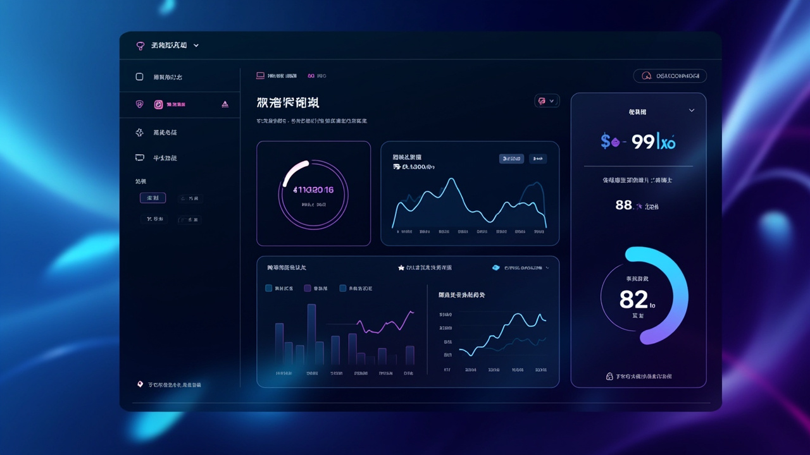
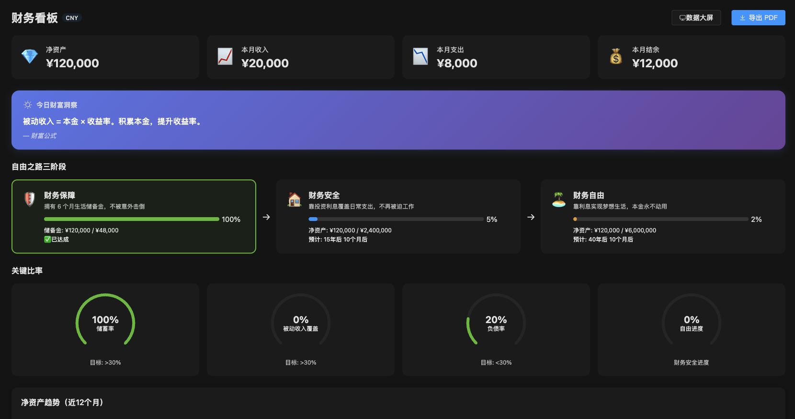
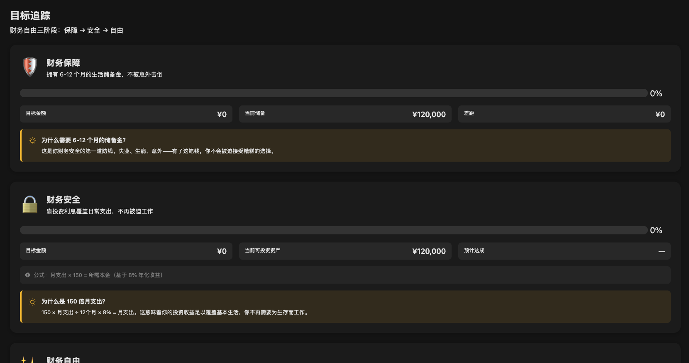
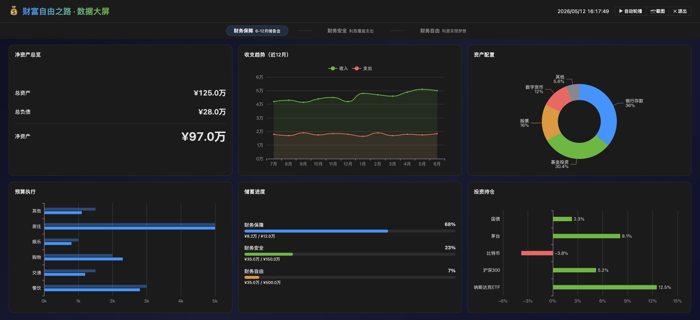

# 💰 财富自由之路 (Wealth Freedom)

> 🖥️ 一款开源的个人财务管理桌面应用 —— 帮你从财务保障走向财务自由
>
> 三阶段理财哲学：**保障** → **安全** → **自由**

[](https://github.com/petterobam/wealth-freedom/releases/latest)

[](https://github.com/petterobam/wealth-freedom/actions/workflows/ci.yml)
[](https://github.com/petterobam/wealth-freedom/releases/latest)
[](https://opensource.org/licenses/MIT)
[](https://github.com/petterobam/wealth-freedom/releases)

**[English](./README.en.md)**
[](https://github.com/petterobam/wealth-freedom/releases)

---

## ✨ 核心功能（v2.0.0）

| 模块 | 功能 | 说明 |
|------|------|------|
| 📊 **仪表盘** | Dashboard | 收支趋势、净资产、支出Top5、财务健康度一目了然 |
| 💳 **交易记录** | Transactions | 收支流水管理，支持分类、搜索、筛选 |
| 🏦 **账户管理** | Accounts | 多账户资产管理，总资产概览+分布饼图 |
| 🎯 **目标追踪** | Goals | 财务三阶段目标设定与进度可视化 |
| 📋 **预算管理** | Budgets | 月度预算设定、执行跟踪、超支预警 |
| 📈 **投资追踪** | Investments | 持仓管理、资产配置、收益计算 |
| 🔄 **周期交易** | Recurring | 自动化房租/工资等定期收支 |
| 🤖 **AI 财务助手** | AI Advice | 智能财务分析与建议（Pro 功能） |
| 💡 **财务洞察** | Insights | 基准对比分析 + 成就系统 |
| 🖥️ **数据大屏** | Big Screen | 全屏可视化展示，6大 ECharts 卡片 |
| 📄 **PDF 报告** | Reports | 一键生成专业财务报告 |
| 🔐 **数据加密** | Encryption | AES-256-GCM 加密保护敏感数据 |
| 🌍 **多语言** | i18n | 中文 / English 双语支持（29 个视图全覆盖） |
| 💱 **多币种** | Multi-Currency | 支持多币种管理与基准币转换 |
| ⏰ **自动备份** | Auto Backup | 启动备份 + 每 6 小时定时备份 |
| 📥 **CSV 导入** | Import | 支持支付宝/微信/通用 CSV 格式导入 |
| 🔑 **许可证系统** | License | 免费/Pro/终身三版，在线激活验证 |
| 🌐 **网页端** | Web App | Next.js 16 + PWA，移动端友好 |

### 🎨 截图

<p align="center">
  
  
</p>
<p align="center">
  
</p>

### 💡 为什么选择 Wealth Freedom？

- 🎯 **三阶段理财哲学** — 不是简单的记账工具，而是一套从「财务保障」到「财务自由」的完整方法论
- 🔒 **数据完全本地** — SQLite 本地存储，你的财务数据永远不会上传到云端
- 🆓 **开源免费** — MIT 协议，核心功能永久免费，Pro 版仅 ¥19/月
- 🌍 **中文优先** — 原生中文支持，贴合国内理财场景（支付宝/微信导入）
- ⚡ **轻量快速** — Electron + Vue 3，流畅体验，安装包仅 111MB

---

## 🚀 快速开始

### 下载安装

**[⬇️ 前往 GitHub Releases 下载最新版本](https://github.com/petterobam/wealth-freedom/releases/latest)**

- **macOS (Apple Silicon)**: DMG (111MB)
- **Linux**: deb (76MB) / AppImage (121MB)
- **Windows**: portable exe (72MB)

### 从源码运行

```bash
# 克隆仓库
git clone https://github.com/petterobam/wealth-freedom.git
cd wealth-freedom

# 安装依赖（需要 Node.js 22+ & pnpm）
pnpm install

# 启动桌面端开发环境
pnpm dev

# 打包 DMG
cd apps/desktop && pnpm build
```

### 网页端

```bash
cd apps/web
pnpm dev
```

---

## 🛠️ 技术栈

| 层级 | 技术 |
|------|------|
| **桌面端** | Electron 31 + Vue 3.5 + TypeScript 5.8 |
| **UI 框架** | Element Plus 2.9 + ECharts 5.6 + Recharts |
| **状态管理** | Pinia 2.3 |
| **数据库** | SQLite (better-sqlite3 11) |
| **构建** | Vite 6 + electron-builder 25 |
| **网页端** | Next.js 16 + React 19 + Tailwind CSS 4 + Prisma |
| **后端** | Cloudflare Workers + D1 |
| **测试** | Vitest + Playwright (41 E2E 测试全部通过) |

---

## 📁 项目结构

```
wealth-freedom/
├── apps/
│   ├── desktop/          # Electron 桌面应用（主产品）
│   │   ├── src/main/     # 主进程（SQLite、IPC、备份、加密）
│   │   └── src/renderer/ # 渲染进程（Vue 3，29 个视图页面）
│   └── web/              # Next.js 网页端
├── packages/shared/      # 共享类型与工具函数
└── pnpm-workspace.yaml   # Monorepo 配置
```

---

## 💎 版本对比

| 功能 | 免费版 | Pro (¥19/月) | 终身 (¥399) |
|------|--------|--------------|-------------|
| 交易记录 | ✅ | ✅ | ✅ |
| 预算管理 | ✅ 限3个 | ✅ 无限 | ✅ 无限 |
| 投资追踪 | ✅ 限3笔 | ✅ 无限 | ✅ 无限 |
| AI 财务助手 | ❌ | ✅ 20次/月 | ✅ 无限 |
| PDF 报告 | ❌ | ✅ | ✅ |
| 数据加密 | ❌ | ✅ | ✅ |
| 数据大屏 | ❌ | ✅ | ✅ |

---

## 🗺️ 功能路线图

- [x] v0.1~0.4 — 资产配置、预算管理、报表导出
- [x] v0.5~0.8 — 投资追踪、暗色模式、PDF报告
- [x] v0.9~1.0 — 订阅授权系统、许可证验证
- [x] v1.1~1.2 — 应用更新检查、周期性交易
- [x] v1.3~1.4 — AI 财务助手、财务洞察+成就
- [x] v1.5~1.6 — 网页端、图表深化、同步API
- [x] v1.7~1.8 — 数据大屏、变现基础设施、E2E测试
- [x] v1.9 — i18n、数据加密、多币种
- [x] v2.0 — 全局错误处理、GitHub Release 🎉
- [x] v2.1 — 全平台构建（Mac + Linux + Windows）、自然语言查询、Demo数据增强
- [ ] v2.2+ — [云端同步](https://github.com/petterobam/wealth-freedom/issues/2) · [移动端](https://github.com/petterobam/wealth-freedom/issues/3) · [AI 深度集成](https://github.com/petterobam/wealth-freedom/issues/4)

---

## 📄 开源协议

MIT License — 自由使用、修改和分发。

---

## 🤝 贡献

欢迎提交 Issue 和 Pull Request！

1. Fork → 2. Feature Branch → 3. Commit → 4. Push → 5. PR

## 🌟 加入我们

> 🚀 **全平台发布 v2.1.8！** Mac + Linux + Windows 全部就绪，成为第一批 ⭐️ Star 用户，和我们一起走向财务自由
>
> 你的 Star 是对开源独立开发者最大的鼓励！

<p align="center">
  <a href="https://github.com/petterobam/wealth-freedom/stargazers">
    
  </a>
  &nbsp;
  <a href="https://github.com/petterobam/wealth-freedom/fork">
    
  </a>
  &nbsp;
  <a href="https://github.com/petterobam/wealth-freedom/watchers">
    
  </a>
</p>

---

**觉得有用？给个 ⭐️ Star 吧！**

📧 [GitHub](https://github.com/petterobam) · [知乎](https://zhihu.com/people/oy6666) · [LinkedIn](https://linkedin.com/in/petterobam)

<!-- SEO: personal finance app, 记账软件, 理财工具, 预算管理, 投资追踪, 财务自由, 个人财务管理, 开源记账, money management, budget tracker, expense tracker, wealth tracker, net worth tracker, financial independence, FIRE, YNAB alternative, Mint alternative, 随手记替代, 挖财替代 -->
