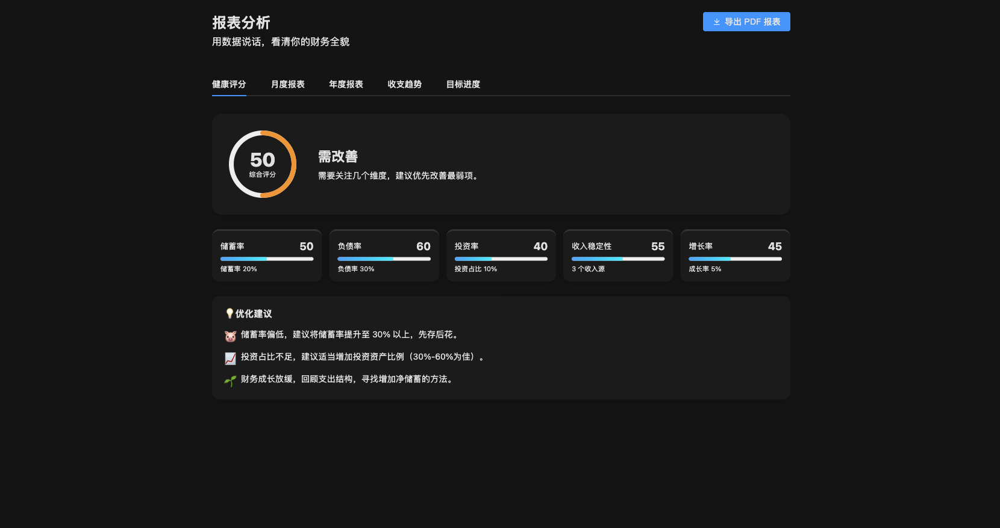
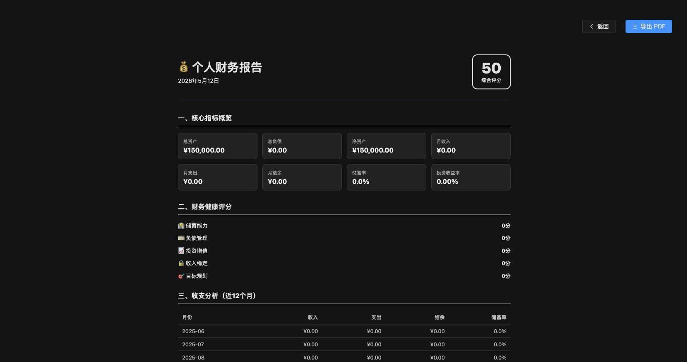
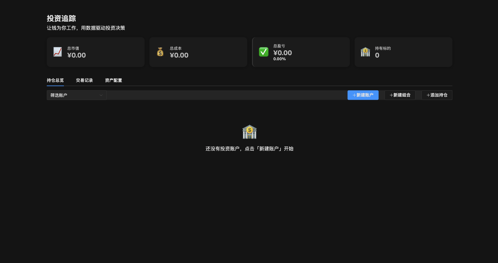
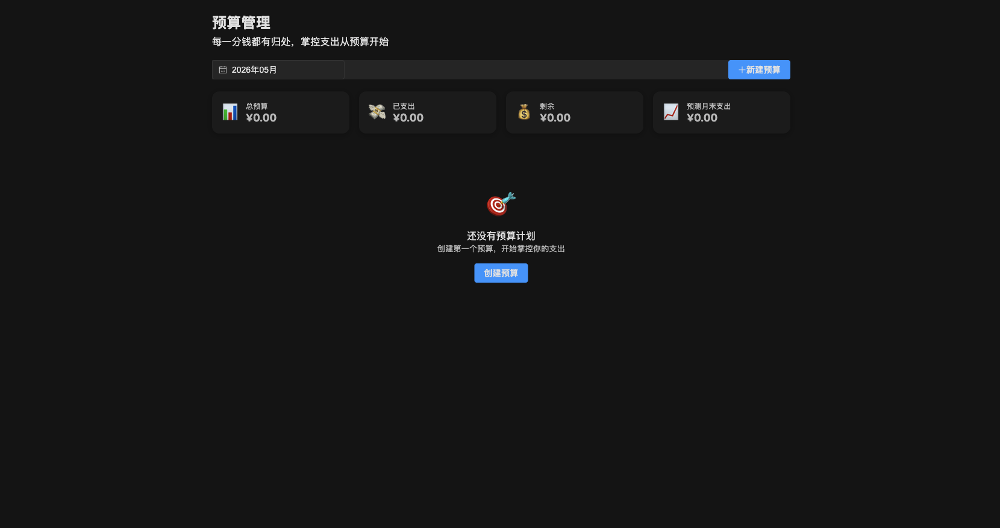
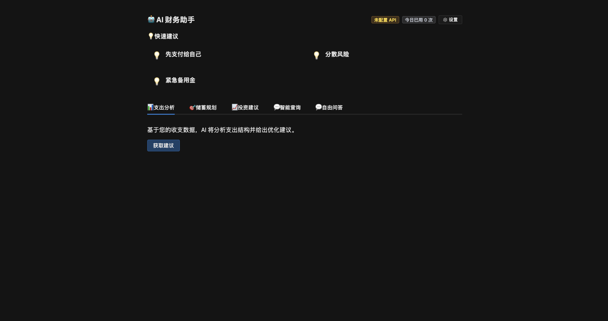
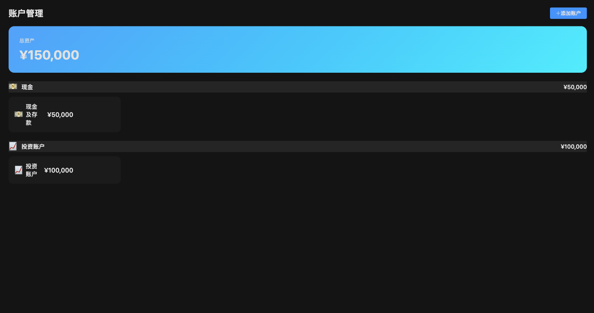

# 💰 Wealth Freedom (财富自由之路)

> 🖥️ Open-source local-first personal finance desktop app for your journey to financial independence
>
> Three-stage philosophy: **Security** → **Safety** → **Freedom**
>
> [中文版 README](./README.cn.md) | [English](./README.en.md)

[](https://github.com/petterobam/wealth-freedom/releases/latest)

[](https://github.com/petterobam/wealth-freedom/actions/workflows/ci.yml)
[](https://github.com/petterobam/wealth-freedom/releases/latest)
[](https://opensource.org/licenses/MIT)
[](https://github.com/petterobam/wealth-freedom/releases)
[](https://github.com/petterobam/wealth-freedom/stargazers)

## 📸 Screenshots

<table>
  <tr>
    <td></td>
    <td></td>
  </tr>
  <tr>
    <td align="center">📊 Dashboard</td>
    <td align="center">🎯 Goal Tracking</td>
  </tr>
  <tr>
    <td></td>
    <td></td>
  </tr>
  <tr>
    <td align="center">📊 Report Analysis</td>
    <td align="center">📄 PDF Report</td>
  </tr>
  <tr>
    <td></td>
    <td></td>
  </tr>
  <tr>
    <td align="center">📈 Investment Tracking</td>
    <td align="center">📋 Budget Management</td>
  </tr>
  <tr>
    <td></td>
    <td></td>
  </tr>
  <tr>
    <td align="center">🤖 AI Financial Advisor</td>
    <td align="center">🏦 Account Management</td>
  </tr>
  <tr>
    <td colspan="2" align="center"></td>
  </tr>
  <tr>
    <td colspan="2" align="center">🖥️ Data Visualization Big Screen</td>
  </tr>
</table>

---

[](https://star-history.com/#petterobam/wealth-freedom&Date)

---

## ✨ 核心功能（v2.0.0）

| 模块 | 功能 | 说明 |
|------|------|------|
| 📊 **仪表盘** | Dashboard | 收支趋势、净资产、支出Top5、财务健康度一目了然 |
| 💳 **交易记录** | Transactions | 收支流水管理，支持分类、搜索、筛选 |
| 🏦 **账户管理** | Accounts | 多账户资产管理，总资产概览+分布饼图 |
| 🎯 **目标追踪** | Goals | 财务三阶段目标设定与进度可视化 |
| 📋 **预算管理** | Budgets | 月度预算设定、执行跟踪、超支预警 |
| 📈 **投资追踪** | Investments | 持仓管理、资产配置、收益计算 |
| 🔄 **周期交易** | Recurring | 自动化房租/工资等定期收支 |
| 🤖 **AI 财务助手** | AI Advice | 智能财务分析与建议（Pro 功能） |
| 💡 **财务洞察** | Insights | 基准对比分析 + 成就系统 |
| 🖥️ **数据大屏** | Big Screen | 全屏可视化展示，6大 ECharts 卡片 |
| 📄 **PDF 报告** | Reports | 一键生成专业财务报告 |
| 🔐 **数据加密** | Encryption | AES-256-GCM 加密保护敏感数据 |
| 🌍 **多语言** | i18n | 中文 / English 双语支持（29 个视图全覆盖） |
| 💱 **多币种** | Multi-Currency | 支持多币种管理与基准币转换 |
| ⏰ **自动备份** | Auto Backup | 启动备份 + 每 6 小时定时备份 |
| 📥 **CSV 导入** | Import | 支持支付宝/微信/通用 CSV 格式导入 |
| 🔑 **许可证系统** | License | 免费/Pro/终身三版，在线激活验证 |
| 🌐 **网页端** | Web App | Next.js 16 + PWA，移动端友好 |

### 🆚 与其他工具对比

| 特性 | Wealth Freedom | Ghostfolio | YNAB | Excel |
|------|--------------|------------|------|-------|
| **数据存储** | 本地SQLite | 云端数据库 | 云端 | 本地 |
| **隐私** | 🔒 完全本地 | 需托管 | 云端 | 本地 |
| **价格** | 免费 / ¥19月 | 免费 / 云服务付费 | $14.99/月 | 免费 |
| **AI助手** | ✅ | ❌ | ❌ | ❌ |
| **财务自由路线图** | ✅ 三阶段 | ❌ | ❌ | 需手动 |
| **自然语言查询** | ✅ | ❌ | ❌ | 需手动 |
| **中文支持** | ✅ 原生 | 部分英文 | 英文 | 手动 |
| **数据大屏** | ✅ 6大卡片 | ❌ | ❌ | 需手动 |
| **安装方式** | 双击安装 | 需Docker部署 | 网页登录 | 手动 |

### 💡 为什么选择 Wealth Freedom？

- 🎯 **三阶段理财哲学** — 不是简单的记账工具，而是一套从「财务保障」到「财务自由」的完整方法论
- 🔒 **数据完全本地** — SQLite 本地存储，你的财务数据永远不会上传到云端
- 🆓 **开源免费** — MIT 协议，核心功能永久免费，Pro 版仅 ¥19/月
- 🌍 **中文优先** — 原生中文支持，贴合国内理财场景（支付宝/微信导入）
- ⚡ **轻量快速** — Electron + Vue 3，流畅体验，安装包仅 111MB

---

## 🚀 快速开始

### 下载安装

**[⬇️ 前往 GitHub Releases 下载最新版本](https://github.com/petterobam/wealth-freedom/releases/latest)**

- **macOS (Apple Silicon)**: DMG (111MB)
- **Linux**: deb (76MB) / AppImage (121MB)
- **Windows**: portable exe (72MB)

### 从源码运行

```bash
# 克隆仓库
git clone https://github.com/petterobam/wealth-freedom.git
cd wealth-freedom

# 安装依赖（需要 Node.js 22+ & pnpm）
pnpm install

# 启动开发服务器
pnpm dev

# 编译打包
pnpm build
pnpm build:mac  # macOS
pnpm build:win  # Windows
pnpm build:linux  # Linux
```

---

## 📖 文档

- **[用户手册](docs/user-guide.md)** - 详细功能说明
- **[开发者文档](docs/developer-guide.md)** - 技术架构与贡献指南
- **[变更日志](CHANGELOG.md)** - 版本历史

---

## 🏗️ 技术架构

### 技术栈

- **框架**: Electron + Vue 3 + TypeScript
- **UI库**: Element Plus
- **数据库**: SQLite (better-sqlite3)
- **图表**: ECharts
- **构建工具**: Vite + electron-vite
- **包管理**: pnpm (monorepo)

### 项目结构

```
wealth-freedom/
├── desktop/          # Electron 主进程 & 预加载脚本
├── renderer/         # Vue 3 前端界面
├── shared/           # 共享代码（类型、工具函数）
├── docs/             # 文档与截图
└── scripts/          # 构建与部署脚本
```

---

## 🤝 贡献

欢迎贡献代码、报告问题或提出建议！

1. Fork 本仓库
2. 创建功能分支 (`git checkout -b feature/AmazingFeature`)
3. 提交更改 (`git commit -m 'Add some AmazingFeature'`)
4. 推送到分支 (`git push origin feature/AmazingFeature`)
5. 提交 Pull Request

---

## 📄 许可证

本项目采用 MIT 许可证 - 详见 [LICENSE](LICENSE) 文件

---

## 🙏 致谢

- [Electron](https://www.electronjs.org/) - 跨平台桌面应用框架
- [Vue.js](https://vuejs.org/) - 渐进式 JavaScript 框架
- [Element Plus](https://element-plus.org/) - 基于 Vue 3 的组件库
- [ECharts](https://echarts.apache.org/) - 数据可视化图表库
- [better-sqlite3](https://github.com/WiseLibs/better-sqlite3) - 异步 SQLite 封装

---

## 📮 联系方式

- **GitHub**: [petterobam/wealth-freedom](https://github.com/petterobam/wealth-freedom)
- **Issues**: [提交问题](https://github.com/petterobam/wealth-freedom/issues)
- **Email**: [GitHub](https://github.com/petterobam)

---

<div align="center">

**如果这个项目对你有帮助，请给个 ⭐ Star 支持一下！**

[⬆️ 回到顶部](#-wealth-freedom-财富自由之路)

</div>
